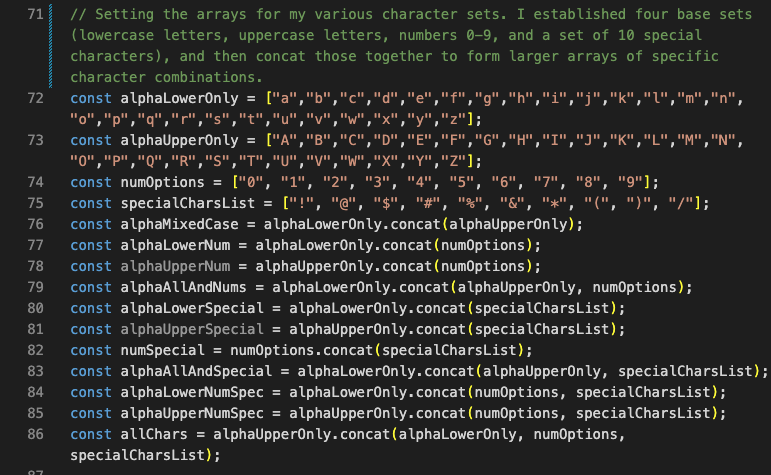
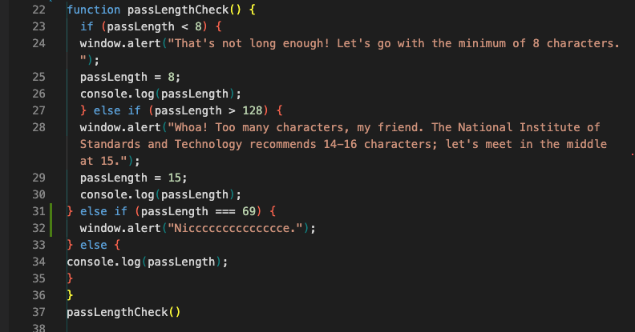
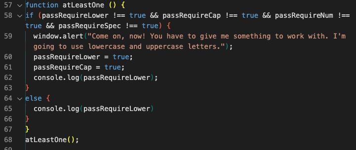
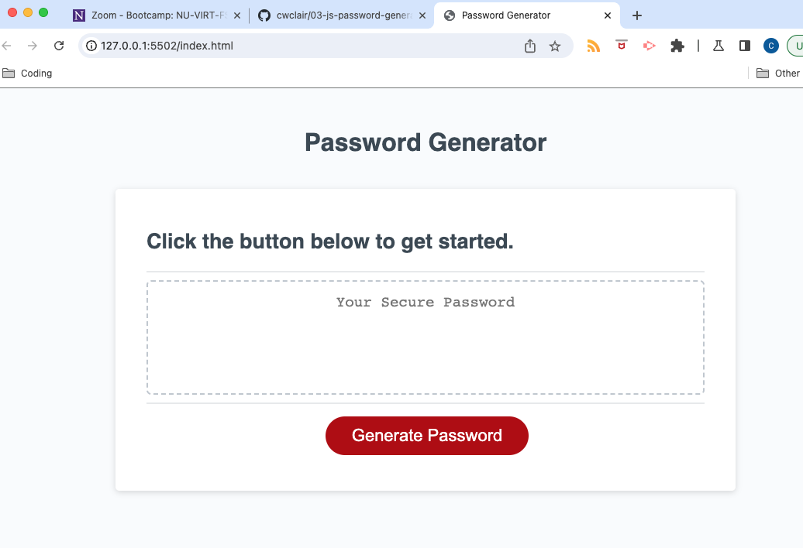
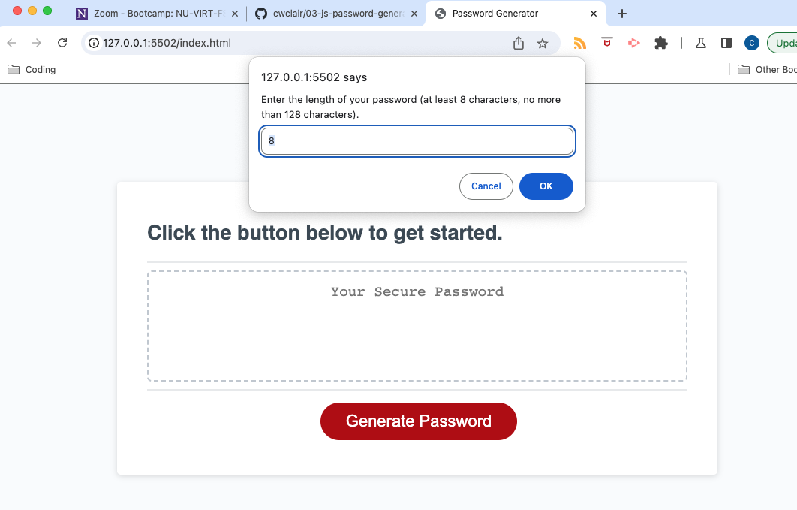
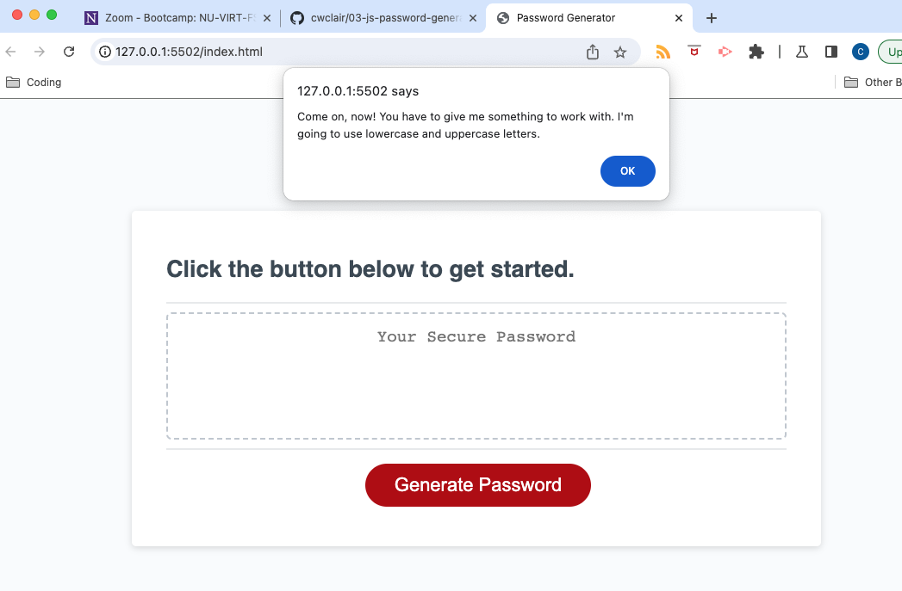
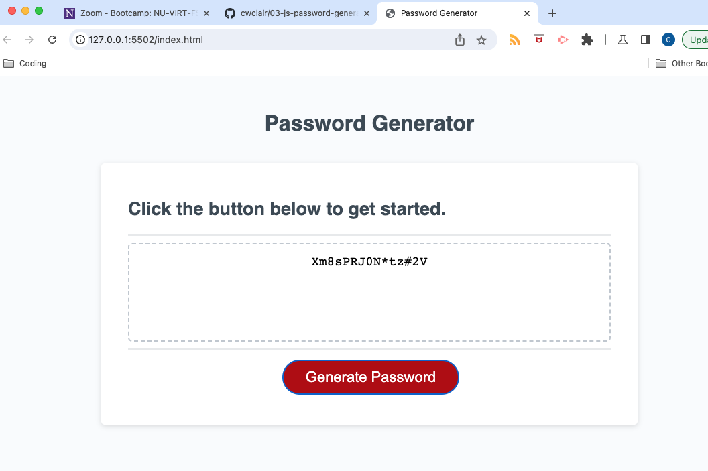

# Week 03: Random Password Generator
Modifying starter code to create an app that generates random passwords based on selected criteria.

## Your Task

This week's Challenge requires you to modify starter code to create an application that enables employees to generate random passwords based on criteria that they’ve selected. This app will run in the browser and will feature dynamically updated HTML and CSS powered by JavaScript code that you write. It will have a clean and polished, responsive user interface that adapts to multiple screen sizes.

The password can include special characters. If you’re unfamiliar with these, see this [list of password special characters](https://www.owasp.org/index.php/Password_special_characters) from the OWASP Foundation.

## User Story

```
AS AN employee with access to sensitive data
I WANT to randomly generate a password that meets certain criteria
SO THAT I can create a strong password that provides greater security
```

## Acceptance Criteria

```
GIVEN I need a new, secure password
WHEN I click the button to generate a password
THEN I am presented with a series of prompts for password criteria
WHEN prompted for password criteria
THEN I select which criteria to include in the password
WHEN prompted for the length of the password
THEN I choose a length of at least 8 characters and no more than 128 characters
WHEN asked for character types to include in the password
THEN I confirm whether or not to include lowercase, uppercase, numeric, and/or special characters
WHEN I answer each prompt
THEN my input should be validated and at least one character type should be selected
WHEN all prompts are answered
THEN a password is generated that matches the selected criteria
WHEN the password is generated
THEN the password is either displayed in an alert or written to the page
```

## Description of the Work

This project started with HTML and CSS already established, and a small foundation of JavaScript code from which to work.

One of the first things I did was establish the various character arrays I would need to generate a password that met the potential user criteria. I set up arrays of lowercase letters, uppercase letters, numbers 0-9, and a collection of 10 special characters. I then used "concat" to create all possible category combinations.



I then mapped out safeguards for keeping the users within the constraints of the character-length acceptance criterion and how to proceed if the user returned a value of "false" for all four character types.

First, the character-length safeguard, a function I called "passLengthCheck". When the user is prompted for a password length, if a number less than 8 is entered, I force the user to use the minimum length of 8. If the user goes over 128, I trot out a statistic about password-length recommendations and set the password in that range (15, to be specific).



And yes, that's an Easter Egg in there that my son basically dared me to put in the code. 

Next, what to do if the user says they don't want to use any of the four character types? That triggers an alert window that points out the issue, and defaults to lowercase and uppercase letters. I call this function atLeastOne.



Last but not least, the engine that randomizes the password string. I start with a blank string assigned to a variable (aptly called "theString") and a counter variable set to zero. I use the boolean values for each base character array to establish which of the character arrays (base or combined) to pull from to generate the string. 

I use "while" to keep the password string growing until the length of the string meets the numeric value of the count. And the combination of Math.random and Math.floor pull the random character from the assigned array. I use a += operator to append the next character onto the existing string. 

You'll notice I ensure that each specified criterion is selected by forcing each of the last "n" characters (1, 2, 3, or 4) to cover each of the specified types. I found when I didn't enforce this, some of the shorter passwords (8 chars, for example) might not return each of the character types if I pulled from the full 72-character array.

While I'm glad the randomizer works, I'm most proud of factoring in the various safeguards to ensure the user stays on track and the password generator delivers what it is supposed to.

Oh, and even though modifying the HTML wasn't part of the requirements, the repetition of the words (or modified version of the words) "password" and "generate" was annoying, so I changed the h2 to instruct the user to click the button to get started. ¯\_(ツ)_/¯

## Overview of Site

How it looks when the user arrives at the page.

  
  
One of the criteria prompts (the password length)

  
  
The message that greets the user if they say no to all four character types.

  
  
A password randomly generated with 15 characters, using all four character types.

  

## Link to Deployed Site

https://cwclair.github.io/03-js-password-generator

## Resources Used

A combination of class lectures/activities and reference articles on W3Schools.